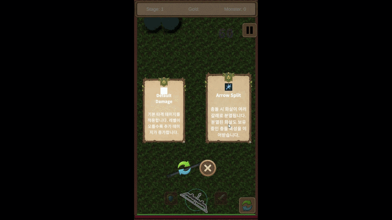
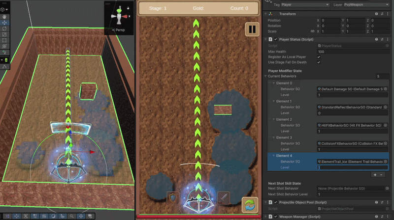
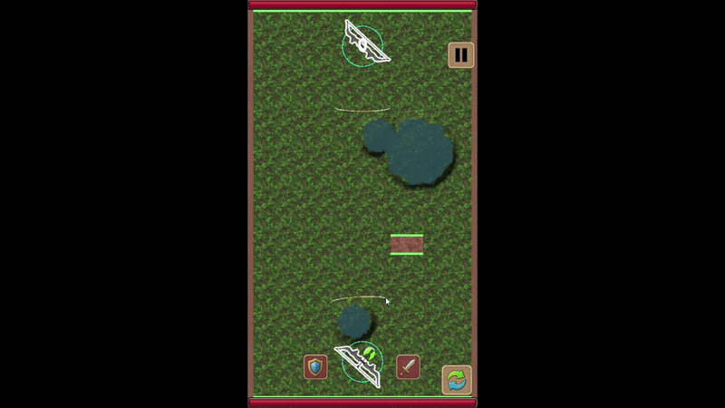

# Shield & Shot Code Map

**Shield & Shot**은 한 손으로 방패를 유지하고 다른 손으로 무기를 조작하며, 몰려오는 몬스터를 막아 내는 Unity 기반 하이퍼캐주얼 슈팅 게임입니다.

한 판은 세 웨이브의 몬스터 방어로 진행됩니다. 웨이브가 끝날 때마다 두 개의 증강 중 하나를 고르고, 불·바람·얼음 속성 무기와 전장 지형, 분열·반사 같은 증강을 조합해 다음 웨이브의 전투 방식을 바꿉니다. 제가 만들고 싶었던 것은 적을 많이 잡는 게임보다, 왼손은 방어를 유지하고 오른손은 조준·차징·발사를 판단하는 순간의 몰입감과 “이번 증강이 뜨면 이 웨이브를 넘길 수 있겠다”는 기대였습니다.

## 프로젝트 개요

| 항목 | 내용 |
|---|---|
| 기간 | 2026.06.04 ~ 2026.07.08 (데모 기준) |
| 엔진 / 언어 | Unity / C# |
| 팀 | 6인 팀 프로젝트 |
| 역할 | 팀장 · PM · 전투/입력/증강/필드/네트워크 시스템 설계 및 통합 |
| 직접 구현·재구성 | Input System V2, Projectile Behavior/Augment, ElementField Grid, Photon Fusion 전투 통합, 플레이 검증 |

저는 게임의 전체 요구사항과 시스템의 경계를 설계하고, 각 기능이 실제 플레이에서 맞물리는지 확인하는 역할을 맡았습니다. 몬스터·캐릭터의 세부 구현은 분담했지만, 어떤 웨이브 경험을 만들지, 어떤 데이터를 주고받아야 하는지, 병합한 기능이 어떤 기준을 만족해야 하는지는 직접 조율했습니다.

> 위 버튼을 누르면 제가 담당한 전체 시스템의 다이어그램과 공개 가능한 코드 전문을 정리한 인터랙티브 코드맵으로 이동합니다.

## 빠르게 보고 싶다면

- **양손 조작과 입력 개선**: [Input V2와 벤치마크](#양손-조작은-입력값을-섬세하게-다뤄야-했습니다)
- **증강과 전장 속성 조합**: [투사체 규칙](#증강은-전투의-기대를-만들었지만-규칙의-한계도-남겼습니다) · [Cell 전장](#전장은-cell을-계속-살아-있게-두지-않고-데이터로-판단했습니다)
- **팀 통합과 네트워크 기반**: [협업 방식과 회고](#협업-방식과-회고)
- **전체 구조와 공개 코드**: [인터랙티브 코드맵](https://sj97p.github.io/Shield-Shot-CodeMap/)

## 이 코드맵에서 말하고 싶은 것

### 양손 조작은 입력값을 섬세하게 다뤄야 했습니다

터치가 시작된 위치로 공격과 방어 영역을 정하고, 손가락이 끝날 때까지 같은 역할을 유지하도록 구성했습니다. 무기는 드래그를 조준 또는 차징으로 해석하고, 방패는 별도의 방어 입력으로 처리합니다. V1은 원시 입력을 세밀하게 관리·보정하기 어려웠기 때문에, V2에서는 입력 수집 → 작은 움직임 필터링 → 공격/방어 라우팅 → 제스처 해석 → 무기/방패 적용을 분리했습니다.

이 작업은 `Update()`를 없애기 위한 것이 아니라, 손떨림 같은 작은 입력을 어디에서 걸러내고 어떤 데이터만 게임플레이에 넘길지 제어하기 위한 것이었습니다. 같은 입력 시나리오를 반복 재생하는 벤치마크도 함께 만들어, 입력 Marker 기준 Windows Development Build 76.36%, Galaxy S23+ 65.83% 감소를 확인했습니다. 이는 전체 게임 CPU나 네트워크 트래픽 수치가 아닙니다.

입력 구조와 측정 근거 보기

`CombatPointerRouter`는 터치 시작 위치에서 공격/방어 채널을 정한 뒤, 해당 포인터가 끝날 때까지 같은 채널로 전달합니다. `PointerMovementThresholdFilter`는 최소 이동 거리보다 작은 움직임을 걸러냅니다. 자세한 비교 조건은 [Input V2 Benchmark](docs/systems/input-system-v2-benchmark.md)에서 확인할 수 있습니다.

### 증강은 전투의 기대를 만들었지만, 규칙의 한계도 남겼습니다

기본 화살에 효과를 계속 덧붙이는 게임이라면 투사체 내부 조건문이 늘어나는 방식으로는 오래 버티기 어렵다고 봤습니다. 그래서 이동·충돌·피격 행동을 Behavior로 나누고, 증강과 무기 효과가 외부에서 주입되도록 구성했습니다.

분열과 난반사처럼 순서에 따라 결과가 달라지는 효과는 `Priority`로 실행 순서를 정했고, 자식 화살에 특정 충돌 Behavior를 복사하지 않아 분열이 무한히 전파되는 것을 막았습니다. 이 방식은 원하는 결과를 빠르게 만들 수 있었지만, 증강 수가 늘수록 우선순위를 사람이 계속 판단해야 하는 한계도 남겼습니다. 다시 만든다면 중간 판정 객체가 효과의 실행 단계와 전파 규칙을 해석하도록 바꾸고 싶습니다.

증강이 적용된 투사체 장면과 코드 보기

`ProjectileBase`는 이동·충돌·피격 Behavior 목록을 Priority 순으로 정렬하고, 자식 투사체로 복사할 때 제외할 충돌 Behavior 타입을 받을 수 있습니다. [투사체 증강 문서](docs/systems/projectile-behavior-augment-injection.md)에서 흐름을 확인할 수 있습니다.

### 전장은 Cell을 계속 살아 있게 두지 않고 데이터로 판단했습니다

전장 모든 셀에 Collider와 GameObject를 두는 방식도 검토했지만, 모바일 환경에서 필드 상태를 관리하는 비용과 디버깅 부담이 커질 수 있다고 판단했습니다. `ElementFieldCellData[,]`를 전장의 기준 데이터로 두고, 불·바람·얼음 필드와 풀·사막·물 지형의 반응을 계산했습니다. Cell 오브젝트는 디버그와 시각화에만 선택적으로 사용하고, 전투 판정은 데이터에서 출발합니다.

불 화살은 풀 위에서 더 넓고 오래 남는 화염 필드를 만들고, 바람과 사막은 열풍처럼 주변에 화염 필드를 남기며, 얼음 화살은 물웅덩이를 얼려 지속적인 감속 지형으로 바꿉니다. 속성 화살과 필드 위에 분열까지 붙었을 때 화면 전체가 VFX로 채워지는 순간이 이 게임에서 의도한 핵심 쾌감이었습니다.

속성 필드 반응 장면 보기

| 불 + 풀 | 바람 + 사막 | 얼음 + 물 |
|---|---|---|
|  |  |  |

[ElementField Grid 문서](docs/systems/element-field-grid.md)에서 데이터 Grid와 반응 처리 흐름을 확인할 수 있습니다.

### 네트워크는 완성된 경쟁 모드가 아니라, 확장을 위한 전투 기반으로 다뤘습니다

향후 1:1 랭킹전과 무기 상성, 협동 몬스터 레이드를 확장 방향으로 두고 Photon Fusion 기반 전투 동기화를 통합했습니다. 이 과정에서는 양쪽 플레이어의 무기·속성·증강·데미지뿐 아니라, 호스트/클라이언트에 따른 스폰 위치와 카메라 방향, VFX 회전을 함께 맞춰야 했습니다.

네트워크 무기·방패 동기화 장면 보기

## 핵심 문서

- [투사체 Behavior와 증강 주입](docs/systems/projectile-behavior-augment-injection.md)
- [ElementField 데이터 Grid](docs/systems/element-field-grid.md)
- [Input System V2 리팩터링](docs/systems/input-system-v2-refactoring.md)
- [입력 V1/V2 벤치마크](docs/systems/input-system-v2-benchmark.md)
- [PvP 투사체 동기화](docs/systems/pvp-network-projectile-sync.md)
- [PvP 통합 복구 회고](docs/systems/pvp-network-recovery-postmortem.md)

## 협업 방식과 회고

### 기획을 구현 기준으로 바꾸고, 통합 전에 먼저 합의했습니다

팀장 겸 PM으로서 “왼손으로 막고 오른손으로 쏘는 전투”, “매 웨이브 뒤 증강 선택”, “속성 조합이 전장을 바꾸는 경험”을 시스템 요구사항으로 나눴습니다. 단순히 담당자를 배정하는 데서 끝내지 않고, 투사체가 생성될 때 결정해야 할 무기·속성·증강 데이터와, 피격 뒤 이벤트로 전달할 VFX·피드백을 먼저 구분했습니다.

이 기준이 있어 서로 다른 팀원이 만든 증강, 투사체, VFX를 PvP 수명주기 안에서 연결할 수 있었습니다. 문제가 생기면 “VFX가 보이지 않는다”는 결과만 공유하지 않고, 생성 데이터·Network Object 생성·피격 이벤트 중 어느 단계가 끊겼는지 함께 확인했습니다. 시스템 단위 브랜치도 이 경계를 기준으로 운영해, 메인 브랜치를 직접 흔들지 않고 기능 단위로 검증·병합할 수 있었습니다.

기능별 개인 브랜치가 메인을 바로 건드리지 않도록 시스템 단위의 상위 브랜치를 두었습니다. 각 담당자는 하위 작업을 먼저 검증하고, 시스템 단위에서 병합을 마친 뒤 메인에 올렸습니다. 이 방식은 병합 대기와 충돌을 줄였을 뿐 아니라, 서로 어떤 경계에서 작업하는지 더 자주 확인하게 했습니다.

이 프로젝트에서 가장 크게 배운 것은 인터페이스만 많이 나누는 것이 곧 확장성은 아니라는 점입니다. 데미지·넉백·VFX처럼 서로 다른 담당자의 기능을 맞추는 공통 규격은 도움이 됐지만, 증강 조합의 실행 순서까지 수동 Priority에 맡기면 결국 시스템이 사람의 기억에 의존하게 됩니다. 다음에는 콘텐츠를 더 쉽게 추가하는 구조와, 플레이어가 느끼는 쾌감을 함께 설계하고 싶습니다.
