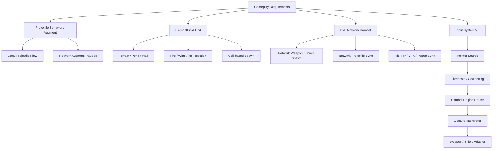

# Architecture Overview

Shield & Shot의 제가 담당한 구조는 크게 네 축으로 나뉩니다.

1. **전투 확장 구조**: 투사체에 직접 조건문을 계속 추가하지 않고, 외부 Behavior를 주입해 증강/스킬/속성 효과를 확장합니다.
2. **속성 필드/아레나 구조**: 셀 기반 필드 데이터를 전투 판정, 지형 반응, 카메라, 스폰, 벽 생성의 공통 기준으로 사용합니다.
3. **PvP 네트워크 구조**: 로컬 전투와 다른 network lifecycle에서 무기/방패/투사체/피격/VFX가 같은 규칙으로 보이도록 동기화합니다.
4. **Input System V2**: 입력 수집부터 무기 적용까지 한 흐름으로 얽혀 있던 책임을 작은 계약과 단계로 분리하고, 동일 시나리오로 V1/V2를 검증합니다.

## High-Level Flow

```mermaid
flowchart TD
    Design[Gameplay Requirements] --> Combat[Projectile Behavior / Augment]
    Design --> Field[ElementField Grid]
    Design --> PVP[PvP Network Combat]
    Design --> Input[Input System V2]

    Combat --> LocalFire[Local Projectile Flow]
    Combat --> NetworkPayload[Network Augment Payload]

    Field --> Terrain[Terrain / Pond / Wall]
    Field --> ElementReaction[Fire / Wind / Ice Reaction]
    Field --> Spawn[Cell-based Spawn]

    PVP --> WeaponSpawn[Network Weapon / Shield Spawn]
    PVP --> ProjectileSync[Network Projectile Sync]
    PVP --> HitSync[Hit / HP / VFX / Popup Sync]

    Input --> Source[Pointer Source]
    Source --> Filter[Threshold / Coalescing]
    Filter --> Router[Combat Region Router]
    Router --> Gesture[Gesture Interpreter]
    Gesture --> Adapter[Weapon / Shield Adapter]
```

## Responsibility Boundaries

| Area | Main Responsibility |
|---|---|
| Projectile Behavior | 증강과 스킬 효과를 hit/collision/movement behavior로 분리 |
| Augment Flow | 선택된 증강을 player status와 projectile runtime behavior로 연결 |
| ElementFieldGrid | 셀 데이터, 좌표 변환, 속성/지형 반응 진입점 |
| Arena Terrain | 필드 데이터를 기반으로 terrain, pond, wall 생성 |
| Network Weapon | 로비 장착 데이터를 PvP Actor에서 ID 기반으로 복구 |
| Network Projectile | 발사 요청, payload 생성, projectile spawn, behavior 주입 |
| PvP Match State | 카운트다운, 전투, 라운드, 증강 선택, 매치 종료 상태 관리 |
| Combat Feedback | hit/collision/reflect VFX와 damage popup을 모든 peer에 표시 |
| Input Source | Unity mouse/touch API를 공통 pointer sample로 변환 |
| Input Policy | UI·viewport·이동 임계값·영역 분할 규칙을 독립적으로 판단 |
| Gesture Interpretation | pointer 흐름을 공격 charge 또는 방어 방향 상태로 변환 |
| Gameplay Adapter | V2의 상태를 기존 WeaponManager 계약에 연결 |
| Input Benchmark | 동일 sample과 marker로 V1/V2의 처리 비용을 반복 비교 |

## Design Principle

- 로컬 전투와 PvP 전투를 완전히 같은 코드로 억지 통합하지 않고, lifecycle이 다른 부분은 분리합니다.
- 대신 damage, behavior, payload, VFX type처럼 공유해야 하는 기준은 명시적인 데이터로 전달합니다.
- Unity inspector 누락이나 prefab 설정 차이가 런타임 전체 실패로 이어지지 않도록 fallback과 방어 로직을 둡니다.
- 진행 중 프로젝트이므로 완성된 항목과 보류된 항목을 문서에서 분리합니다.
- 입력 V2는 SRP로 단계별 변경 이유를 분리하고, 작은 인터페이스(ISP)와 생성 지점의 의존성 조립(DIP)으로 Unity 컴포넌트 간 직접 결합을 줄였습니다.
- 추상화는 모든 클래스에 적용하지 않고 대체 구현·정책 교환·테스트 대역이 필요한 경계에만 두었습니다. 이 기준으로 기능적 응집도를 높이면서 불필요한 인터페이스 증식을 피했습니다.
