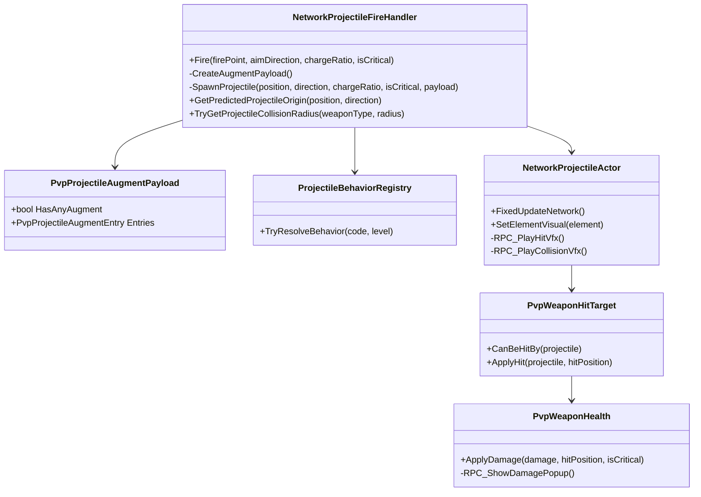
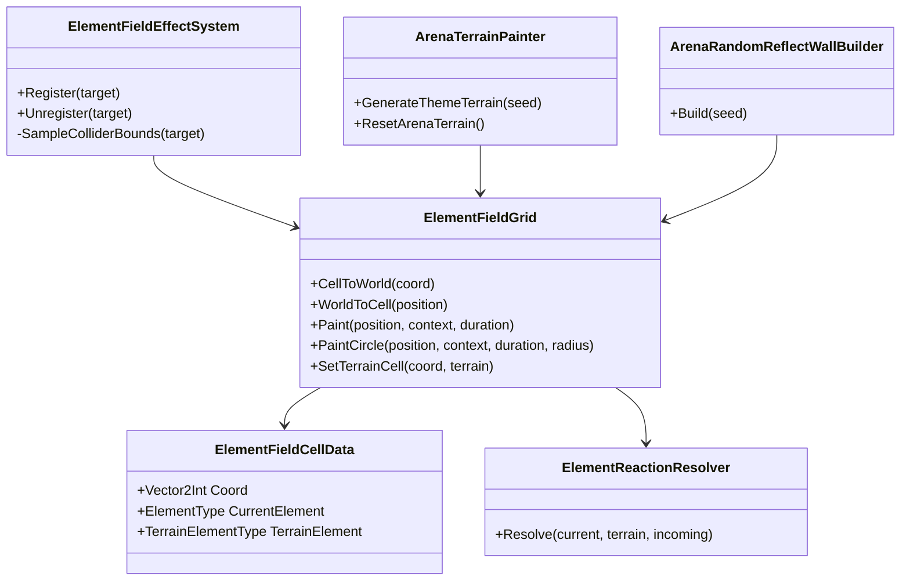

# Class Diagram

## PvP Projectile / Combat Feedback

```mermaid
classDiagram
    class NetworkProjectileFireHandler {
        +Fire(firePoint, aimDirection, chargeRatio, isCritical)
        -CreateAugmentPayload()
        -SpawnProjectile(position, direction, chargeRatio, isCritical, payload)
        +GetPredictedProjectileOrigin(position, direction)
        +TryGetProjectileCollisionRadius(weaponType, radius)
    }

    class PvpProjectileAugmentPayload {
        +bool HasAnyAugment
        +PvpProjectileAugmentEntry Entries
    }

    class ProjectileBehaviorRegistry {
        +TryResolveBehavior(code, level)
    }

    class NetworkProjectileActor {
        +FixedUpdateNetwork()
        +SetElementVisual(element)
        -RPC_PlayHitVfx()
        -RPC_PlayCollisionVfx()
    }

    class PvpWeaponHitTarget {
        +CanBeHitBy(projectile)
        +ApplyHit(projectile, hitPosition)
    }

    class PvpWeaponHealth {
        +ApplyDamage(damage, hitPosition, isCritical)
        -RPC_ShowDamagePopup()
    }

    NetworkProjectileFireHandler --> PvpProjectileAugmentPayload
    NetworkProjectileFireHandler --> ProjectileBehaviorRegistry
    NetworkProjectileFireHandler --> NetworkProjectileActor
    NetworkProjectileActor --> PvpWeaponHitTarget
    PvpWeaponHitTarget --> PvpWeaponHealth
```

## ElementField / Arena

```mermaid
classDiagram
    class ElementFieldGrid {
        +CellToWorld(coord)
        +WorldToCell(position)
        +Paint(position, context, duration)
        +PaintCircle(position, context, duration, radius)
        +SetTerrainCell(coord, terrain)
    }

    class ElementFieldCellData {
        +Vector2Int Coord
        +ElementType CurrentElement
        +TerrainElementType TerrainElement
    }

    class ElementReactionResolver {
        +Resolve(current, terrain, incoming)
    }

    class ElementFieldEffectSystem {
        +Register(target)
        +Unregister(target)
        -SampleColliderBounds(target)
    }

    class ArenaTerrainPainter {
        +GenerateThemeTerrain(seed)
        +ResetArenaTerrain()
    }

    class ArenaRandomReflectWallBuilder {
        +Build(seed)
    }

    ElementFieldGrid --> ElementFieldCellData
    ElementFieldGrid --> ElementReactionResolver
    ElementFieldEffectSystem --> ElementFieldGrid
    ArenaTerrainPainter --> ElementFieldGrid
    ArenaRandomReflectWallBuilder --> ElementFieldGrid
```
