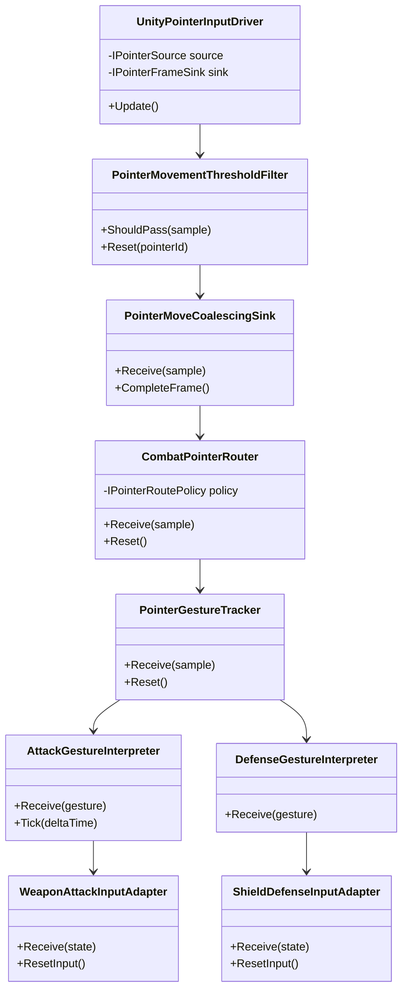
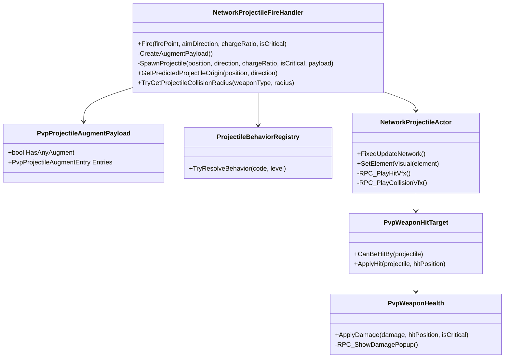
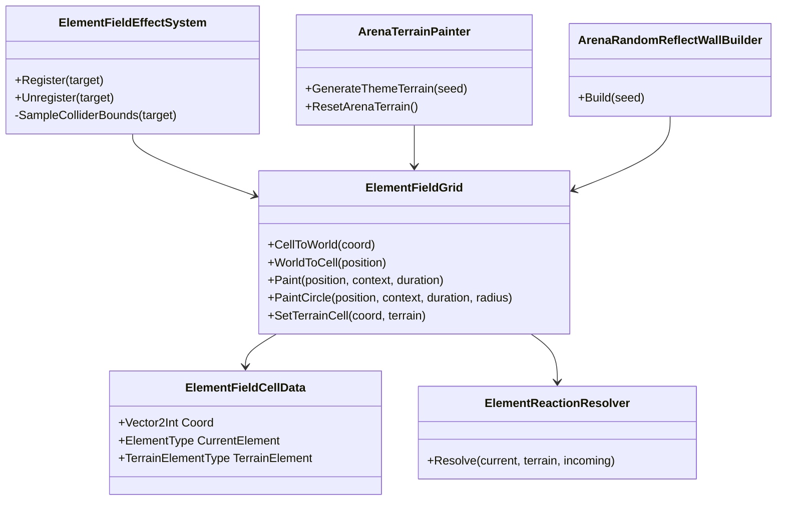

# Class Diagram

## Input System V2

각 연결은 구체 MonoBehaviour를 직접 호출하는 대신 작은 입력/출력 계약을 통과합니다. 따라서 입력 소스, 필터, 영역 정책, 공격·방어 해석기, 기존 무기 연결부를 서로 독립적으로 교체하고 측정할 수 있습니다.

## PvP Projectile / Combat Feedback

## ElementField / Arena

