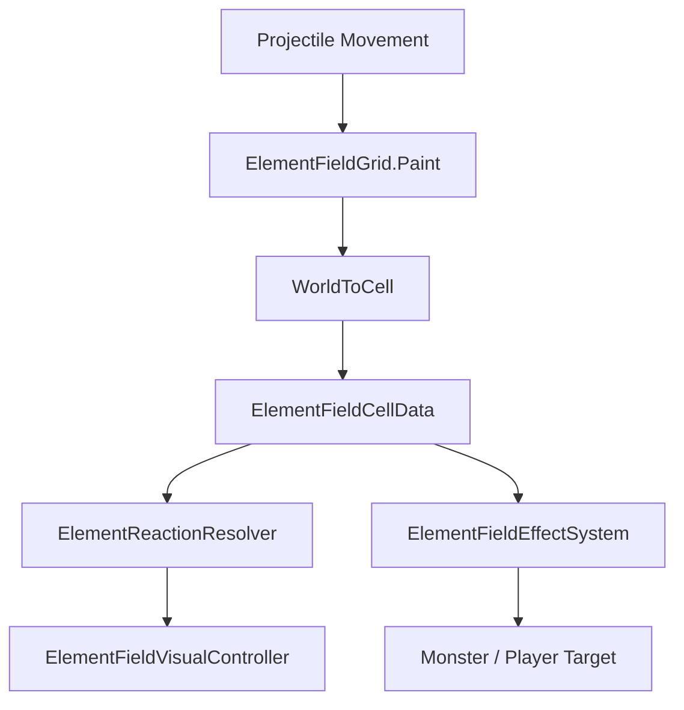

# ElementField Grid

## Problem

불, 바람, 얼음 같은 속성 효과는 단순한 직접 타격 효과만으로 표현하기 어려웠습니다. 특히 fire projectile은 적에게 직접 화상만 거는 것보다 지나간 경로에 필드를 남기고, terrain과 반응하는 방식이 더 자연스러웠습니다.

초기 cell 기반 구현은 GameObject와 Collider에 의존할 수 있었지만, 셀 수가 늘어나고 몬스터 크기와 terrain 반응이 들어오면서 다음 문제가 생겼습니다.

- cell마다 GameObject/Collider를 유지하면 비용이 커짐
- 큰 몬스터는 pivot이 다른 셀에 있으면 장판 효과를 받지 못함
- transform scale과 collider size가 이중 적용될 수 있음
- 카메라, 스폰, 벽, 필드 효과가 서로 다른 좌표 기준을 사용함

## Solution

`ElementFieldGrid`를 전투 필드의 기준 좌표계로 두고, cell 상태는 `ElementFieldCellData[,]` 데이터 그리드로 관리했습니다.

```text
ElementFieldGrid
-> CellToWorld / WorldToCell
-> ElementFieldCellData[,] 관리
-> Paint / PaintCircle
-> TerrainElementType 관리
-> ElementReactionResolver 호출
-> Camera / Spawn / Wall 기준 제공
```

## Flow



## Technical Postmortem

가장 큰 전환점은 **GameObject cell 중심에서 data grid 중심으로 바꾼 것**입니다. cell object는 디버그/시각화에는 유용하지만, 전투 판정과 상태 저장까지 담당하면 확장성이 떨어졌습니다.

데이터 그리드로 전환하면서 전투 판정은 cell data를 기준으로 하고, visual은 변경 이벤트를 받아 표현만 담당하도록 분리했습니다.

## Portfolio Point

이 시스템은 속성 장판만을 위한 기능이 아니라, 아레나의 좌표 기준, 스폰 위치, terrain 반응, VFX, 카메라 fit까지 연결되는 게임플레이 기반 구조입니다.
