# Input System V2 Refactoring

## 한 줄 요약

프레임마다 반복 신호를 하위 시스템으로 전달하던 V1 입력 경로를, 입력 수집·필터·라우팅·제스처·게임플레이 변환 책임이 분리된 V2 파이프라인으로 재설계했다. 기존 V1은 기준선으로 보존하고 동일 입력을 반복 재생해 Windows Development Build에서 76.36%, Galaxy S23+에서 65.83%의 입력 Marker 비용 감소를 확인했다.

## 왜 다시 설계했는가

처음 문제는 실제 플레이에서 활의 조작 반응이 굼뜨고, 드래그 중 입력 갱신이 지나치게 자주 발생한다는 체감에서 시작했다. 코드를 따라가 보니 V1은 다음 흐름을 사용하고 있었다.

```text
InputProvider
-> TouchRouter
-> GestureAnalyzer
-> PlayerInputReceiver
-> WeaponBase / Shield
```

각 클래스가 분리되어 있기는 했지만 입력을 읽는 주기와 제스처를 갱신하는 주기, 게임플레이 명령을 발행하는 주기가 사실상 프레임 흐름으로 연결되어 있었다. 작은 포인터 이동이나 유지 상태도 `GestureUpdate`를 통해 계속 전달될 수 있었고, 후속 소비자로 UI, VFX 또는 네트워크 전송이 붙으면 로컬 입력 빈도가 그대로 전체 시스템 비용으로 번질 가능성이 있었다.

단순히 `Update()` 몇 개를 줄이는 것으로는 이 문제를 해결하기 어렵다고 판단했다. 입력 경계에서 불필요한 데이터를 걸러내고, 동일 프레임의 이동을 병합하고, 의미 있는 상태 변화만 게임플레이로 전달하는 구조가 필요했다.

## 기존 코드를 직접 수정하지 않은 이유

V1을 즉시 리팩터링하면 기능 회귀가 발생했을 때 원래 동작과 비교하기 어렵고, 최적화 전 수치도 잃게 된다. 그래서 V1을 보존하고 V2를 별도 경로로 구축했다.

이 결정으로 다음이 가능해졌다.

- 같은 씬에서 V1과 V2를 상호 배타적으로 전환
- 동일한 합성 입력을 두 버전에 주입
- 기존 활·방패 동작과 V2 결과 비교
- 성능이 나빠지면 V1으로 즉시 복귀
- 개선 전후 코드를 포트폴리오에서 직접 비교

## 최종 파이프라인

```mermaid
flowchart LR
    Source[UnityPointerSource] --> Driver[UnityPointerInputDriver]
    Driver --> Viewport[Viewport Start Filter]
    Viewport --> UI[UI Start Filter]
    UI --> Threshold[Movement Threshold Filter]
    Threshold --> Coalescer[Move Coalescing Sink]
    Coalescer --> Router[CombatPointerRouter]
    Router --> AttackTracker[Attack Gesture Tracker]
    Router --> DefenseTracker[Defense Gesture Tracker]
    AttackTracker --> AttackInterpreter[AttackGestureInterpreter]
    DefenseTracker --> DefenseInterpreter[DefenseGestureInterpreter]
    AttackInterpreter --> WeaponAdapter[WeaponAttackInputAdapter]
    DefenseInterpreter --> ShieldAdapter[ShieldDefenseInputAdapter]
```



## 클래스별 책임

| 클래스 | 단일 책임 | 변경 이유 |
|---|---|---|
| `UnityPointerSource` | Unity Mouse/Touch를 공통 `PointerSample`로 변환 | Unity API 의존성을 파이프라인 밖으로 격리 |
| `UnityPointerInputDriver` | Source의 생명주기와 프레임 완료 신호 연결 | 입력 수집과 입력 해석 분리 |
| `PointerStartBlockFilter` | 포인터 시작 허용 여부만 판단 | 화면 밖/UI 시작 정책을 후속 제스처와 분리 |
| `PointerMovementThresholdFilter` | 최소 이동 거리 미만의 잡음 제거 | 미세 떨림이 하위 계층까지 전파되는 문제 차단 |
| `PointerMoveCoalescingSink` | 같은 프레임의 Move를 마지막 값으로 병합 | 고빈도 입력과 프레임 처리 빈도 분리 |
| `CombatPointerRouter` | 입력 위치를 공격/방어 채널로 전달 | 영역 판정과 제스처 상태 추적 분리 |
| `SplitCombatInputChannelResolver` | 좌우·상하·비율·반전 규칙 계산 | UI 설정 정책을 Router 구현에서 분리 |
| `PointerGestureTracker` | 포인터 생명주기를 Gesture 상태로 변환 | 공격/방어 의미를 모르는 재사용 가능한 상태 추적 |
| `AttackGestureInterpreter` | 조준 가능 여부와 차징 상태 해석 | 시간 기반 공격 규칙을 무기 구현에서 분리 |
| `DefenseGestureInterpreter` | 방어 드래그의 시작·방향·종료 해석 | 방패 회전 구현과 포인터 상태 분리 |
| `WeaponAttackInputAdapter` | 공격 도메인 출력을 기존 무기 API로 번역 | V2가 `WeaponBase` 세부 구현에 직접 결합되지 않게 함 |
| `ShieldDefenseInputAdapter` | 방어 도메인 출력을 방패 궤도 API로 번역 | V2가 `SkillShield` 생성 과정에 직접 결합되지 않게 함 |
| `CombatInputSettingsBridge` | 저장된 설정을 Runtime Layout으로 변환 | 설정 저장 책임과 입력 실행 책임 분리 |
| `InputSystemV2RuntimeBehaviour` | 제품 Runtime의 Composition Root | 객체 조립은 한곳에서 수행하되 개별 규칙은 위임 |

## SOLID를 어떻게 적용했는가

### SRP — 단일 책임 원칙

V1의 문제를 하나의 거대한 클래스로 합쳐져 있었다고 단순화하지 않았다. 실제 문제는 서로 다른 변경 주기가 프레임 이벤트를 통해 강하게 묶여 있다는 점이었다. V2에서는 “왜 바뀌는가”를 기준으로 클래스를 나눴다.

- Unity 입력 API가 바뀌면 Source만 변경
- UI 차단 정책이 바뀌면 Start Block Policy만 변경
- 이동 임계값이 바뀌면 Threshold Filter만 변경
- 공격 차징 규칙이 바뀌면 Attack Interpreter만 변경
- 활 또는 방패 API가 바뀌면 Adapter만 변경

### OCP — 개방·폐쇄 원칙

필터와 Sink가 작은 계약으로 연결되므로 새로운 필터를 기존 Router나 Gesture 코드 수정 없이 파이프라인에 삽입할 수 있다. 이후 빠른 드래그 시 차징 해제, 네트워크 전송 제한 또는 접근성 보정도 별도 정책으로 확장할 수 있다.

### LSP — 리스코프 치환 원칙

Runtime과 Benchmark가 동일한 입력 계약을 사용한다. 실제 Unity Source 대신 `SyntheticPointerSource`를 사용해도 하위 파이프라인의 의미가 바뀌지 않는다. V1/V2 Adapter 역시 동일한 `IBenchmarkPointerInputTarget` 계약을 구현한다.

### ISP — 인터페이스 분리 원칙

하나의 거대한 `IInputSystem`을 만들지 않았다. 소비자가 필요한 최소 기능만 알도록 계약을 분리했다.

- `IPointerSource`
- `IPointerSampleSink`
- `IPointerFrameSink`
- `IPointerStartBlockPolicy`
- `ICombatInputLayoutProvider`
- `IAttackInputSink`
- `IDefenseInputSink`

### DIP — 의존 역전 원칙

Gesture와 Router는 Unity의 `Touch`, `Mouse`, `EventSystem`을 직접 알지 않는다. 공격 해석기는 구체 무기 클래스를 모르고 `IAttackInputSink`에 출력한다. Unity API와 기존 게임플레이 API는 Source, Policy, Adapter라는 경계 구현에만 남겼다.

## 결합도와 응집도를 판단한 기준

인터페이스 수를 늘리는 것이 목표는 아니었다. 다음 중 하나가 실제로 존재할 때만 경계를 만들었다.

- 구현을 교체할 필요가 있는가
- 독립적으로 테스트해야 하는가
- 변경 이유가 다른가
- 외부 프레임워크 의존성을 격리해야 하는가

이 기준으로 자료 결합에 가까운 작은 불변 데이터 구조를 전달했다. `PointerSample`, `AttackInputSample`, `DefenseInputSample`, `CombatInputLayout`은 필요한 데이터만 담는다. 반대로 한 기능을 수행하는 과정은 해당 클래스 내부에 모아 기능적 응집도를 높였다.

## 진단과 제품 Runtime 분리

초기 V2에서는 Live Diagnostic Behaviour가 실제 파이프라인을 소유해 진단을 끄면 무기 입력도 멈추는 문제가 있었다. 제품 코드의 생명주기가 개발 도구에 의존하는 구조였다.

이를 다음처럼 분리했다.

```text
InputSystemV2RuntimeBehaviour = 실제 입력 처리와 게임플레이 출력
Live Diagnostic Behaviour    = 선택적 관찰과 카운터 표시
Benchmark Adapter            = 결정론적 외부 입력 주입
```

진단을 비활성화해도 활과 방패가 정상 동작하며, 벤치마크에서는 V2에만 진단 비용이 포함되는 불공정한 조건을 제거했다.

## 설정 확장

`CombatInputLayout`과 `RuntimeCombatInputLayoutProvider`를 통해 다음 설정을 실행 중 변경할 수 있다.

- 좌우 / 상하 분할
- 분할 비율
- 방패 위치 반전

`GameSettingsManager`가 저장과 변경 이벤트를 담당하고, `CombatInputSettingsBridge`가 이를 V2 도메인 설정으로 변환한다. 입력 UI는 V2 Runtime을 직접 조작하지 않는다.

## 결과

- 기존 V1 기능을 유지하면서 활과 방패를 V2에 연결
- 화면 밖 및 UI 위에서 시작한 입력 차단
- 좌우·상하, 비율, 반전 설정과 영구 저장
- 제품 Runtime, 진단, 벤치마크 생명주기 분리
- Windows Development Build 입력 Marker 비용 76.36% 감소
- Galaxy S23+ 실제 기기 입력 Marker 비용 65.83% 감소

정량 검증 방식과 수치 해석은 [V1/V2 Deterministic Benchmark](input-system-v2-benchmark.md)에 기록했다.

