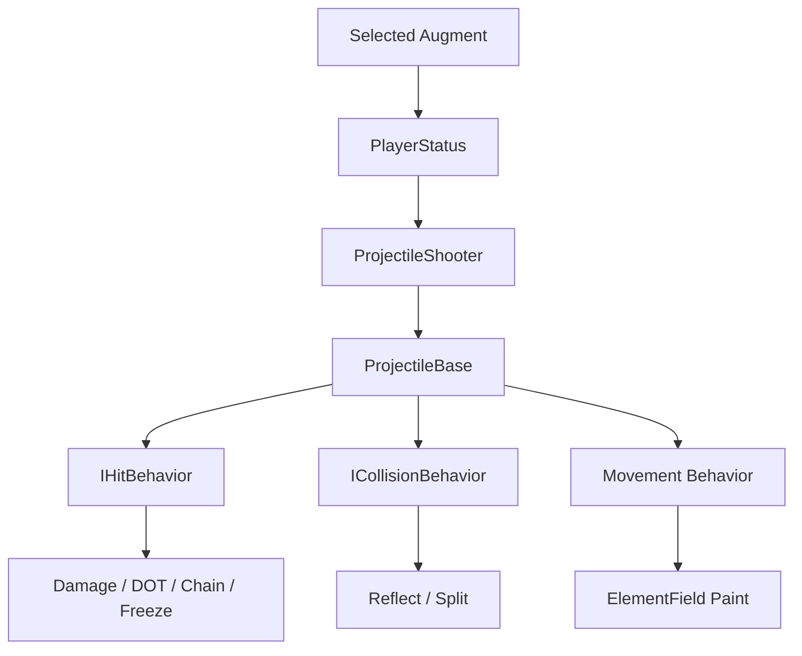

# Projectile Behavior & Augment Injection

## Problem

초기 목표는 체인 라이트닝 같은 특수 화살 스킬을 추가하는 것이었습니다. 하지만 구현을 진행하면서 단일 스킬 추가로 끝낼 수 없다는 점이 드러났습니다.

- 항상 적용되는 증강
- 다음 화살에만 적용되는 1회성 스킬
- 직접 타격 효과
- 벽/방패/환경 충돌 효과
- 이동 중 필드에 남는 속성 효과

각 효과는 적용 시점과 생명주기가 달랐고, 이를 `ProjectileBase` 내부 조건문으로 계속 추가하면 전투 구조가 빠르게 복잡해질 수 있었습니다.

## Design Requirement

제가 설계한 핵심 요구사항은 다음과 같습니다.

> 투사체 효과는 외부에서 주입 가능한 Behavior로 확장되어야 하며, 증강/스킬/속성 효과는 같은 projectile lifecycle 안에서 우선순위와 실행 시점에 따라 조립되어야 한다.

`ProjectileShooter`, `ProjectileBase`, `WeaponManager`, `PlayerStatus`의 기본 구현은 팀원과 분담되었고, 저는 외부 주입 기반 증강 확장 요구사항을 설계한 뒤 구현된 구조를 내부에서 수정/통합했습니다.

## Solution

`ProjectileBehaviorSO`를 기준으로 주입 가능한 효과를 정의하고, 실행 시점별 behavior를 분리했습니다.

```text
Always-on augment
-> PlayerStatus.CurrentBehaviors
-> ProjectileShooter
-> ProjectileBase runtime behaviors

Next-shot skill
-> PlayerStatus next shot slot
-> ProjectileShooter
-> consume after fire

Direct hit effect
-> IHitBehavior
-> DefaultDamage / ChainLightning / Poison / Pierce / Freeze

Collision effect
-> ICollisionBehavior
-> Reflect / RandomReflect / Split

Movement effect
-> Movement Behavior
-> ElementTrail / FieldPaint
```

## Flow



## Technical Postmortem

가장 어려웠던 부분은 **증강을 어떤 순서로 주입하고 실행할지**였습니다. 반사, 관통, 분열, 데미지 변형, 상태이상, 속성 trail은 모두 projectile에 붙지만 같은 순간에 실행되지 않습니다.

이 문제를 해결하기 위해 hit/collision/movement behavior를 분리하고, 기본 damage와 증강 damage, 1회성 skill, 항상 적용되는 augment가 섞이지 않도록 기준을 세웠습니다.

## Portfolio Point

이 구조의 핵심은 “스킬 하나를 추가한 것”이 아니라, 이후 증강과 속성 효과가 계속 추가되어도 projectile core를 직접 수정하지 않고 확장할 수 있도록 설계한 점입니다.
