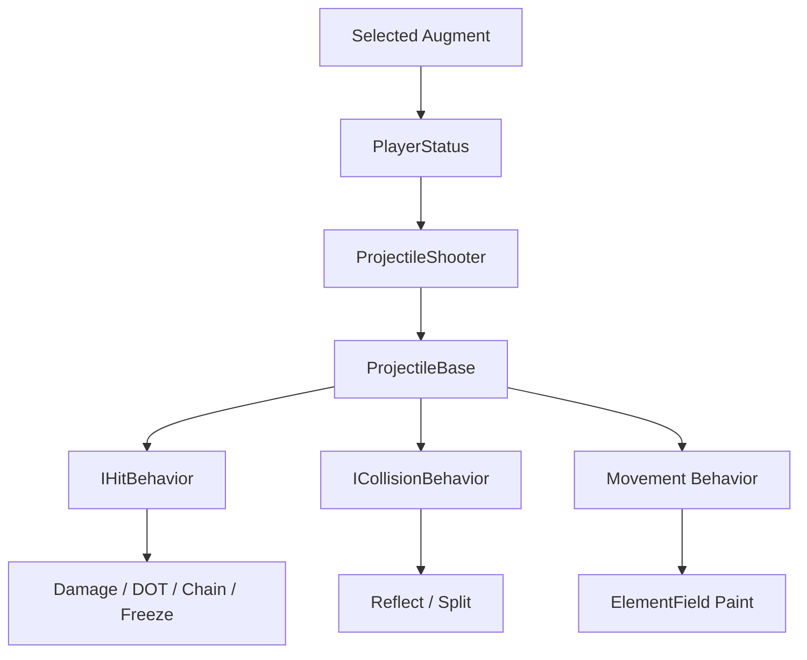

# Projectile Behavior & Augment Injection

## Problem

목표는 같은 라운드라도 플레이어마다 다른 전투 경험을 만들 수 있게 하는 것이었습니다. 랜덤으로 제시되는 화살 증강과 몬스터의 패턴·특성이 조합되면, 단일 스킬 하나를 추가하는 방식만으로는 관리하기 어렵다는 점이 드러났습니다.

- 항상 적용되는 증강
- 다음 화살에만 적용되는 1회성 스킬
- 직접 타격 효과
- 벽/방패/환경 충돌 효과
- 이동 중 필드에 남는 속성 효과

각 효과는 적용 시점과 생명주기가 달랐고, 이를 `ProjectileBase` 내부 조건문으로 계속 추가하면 전투 구조가 빠르게 복잡해질 수 있었습니다. 특히 분열과 난반사가 함께 있을 때는 실행 순서에 따라 분열된 화살에 다음 효과가 적용될 수도, 적용되지 않아야 할 수도 있었습니다.

## Design Requirement

제가 설계한 핵심 요구사항은 다음과 같습니다.

> 투사체 효과는 외부에서 주입 가능한 Behavior로 확장되어야 하며, 증강/스킬/속성 효과는 같은 projectile lifecycle 안에서 우선순위와 실행 시점에 따라 조립되어야 한다.

`ProjectileShooter`, `ProjectileBase`, `WeaponManager`, `PlayerStatus`의 기본 구현은 팀원과 분담되었고, 저는 외부 주입 기반 증강 확장 요구사항을 설계한 뒤 구현된 구조를 내부에서 수정/통합했습니다.

## Solution

`ProjectileBehaviorSO`를 기준으로 주입 가능한 효과를 정의하고, 실행 시점별 behavior를 분리했습니다. `priority`로 조합 순서를 제어하고 `inherit`로 자식 화살에 behavior를 전달할지 결정해, 분열이 다시 분열을 낳는 식의 원치 않는 재귀 전파를 구조적으로 제한했습니다.

```text
Always-on augment
-> PlayerStatus.CurrentBehaviors
-> ProjectileShooter
-> ProjectileBase runtime behaviors

Next-shot skill (증강과 유사한 구조의 별도 스킬)
-> PlayerStatus next shot slot
-> ProjectileShooter
-> consume after fire

Direct hit effect
-> IHitBehavior
-> DefaultDamage / ChainLightning / Poison / Pierce / Freeze

Collision effect
-> ICollisionBehavior
-> Reflect / RandomReflect / Split

Movement effect
-> Movement Behavior
-> ElementTrail / FieldPaint
```

## Flow


```mermaid
flowchart TD
    Augment[Selected Augment] --> Status[PlayerStatus]
    Status --> Shooter[ProjectileShooter]
    Shooter --> Projectile[ProjectileBase]
    Projectile --> Hit[IHitBehavior]
    Projectile --> Collision[ICollisionBehavior]
    Projectile --> Movement[Movement Behavior]
    Hit --> Damage[Damage / DOT / Chain / Freeze]
    Collision --> Reflect[Reflect / Split]
    Movement --> Field[ElementField Paint]
```

## Technical Postmortem

가장 어려웠던 부분은 **증강을 어떤 순서로 주입하고 실행할지, 그리고 자식 화살까지 무엇을 물려줄지**였습니다. 반사, 관통, 분열, 데미지 변형, 상태이상, 속성 trail은 모두 projectile에 붙지만 같은 순간에 실행되지 않습니다.

이 문제를 해결하기 위해 hit/collision/movement behavior를 분리하고, 기본 damage와 증강 damage, 1회성 skill, 항상 적용되는 augment가 섞이지 않도록 기준을 세웠습니다.

## Portfolio Point

이 구조의 핵심은 “스킬 하나를 추가한 것”이 아니라, 새 증강을 조합할 때 projectile core를 직접 수정하지 않으면서도 priority와 inherit 규칙으로 의도한 결과를 만들 수 있게 한 점입니다. 아직 복잡한 조합이 겹칠 때 재귀 전파로 게임이 멈출 수 있는 한계가 있어, 다음 단계에서는 판정·전파·수명 규칙을 더 구조적으로 제한할 필요가 있습니다.
