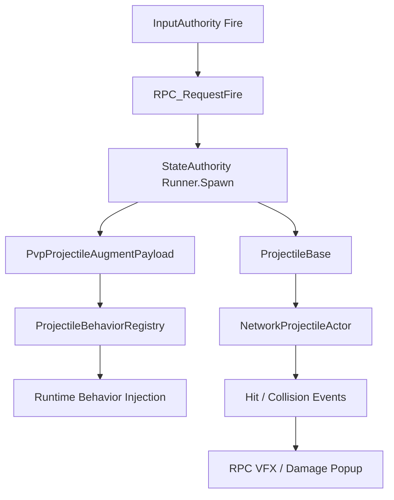

# PvP Network Projectile Sync

## Problem

로컬 projectile은 `ProjectileShooter`가 생성하고 `ProjectileBase.Update`에서 직접 시뮬레이션됩니다. 반면 PvP projectile은 Photon Fusion의 network object lifecycle을 따르며, state authority에서 spawn되고 `NetworkProjectileActor.FixedUpdateNetwork`에서 시뮬레이션됩니다.

이 차이 때문에 로컬에서는 동작하던 증강, damage, VFX가 네트워크 projectile에서는 누락될 수 있었습니다.

## Solution

네트워크 발사는 `NetworkProjectileFireHandler`가 담당하고, 선택된 증강은 SO 참조 대신 `PvpProjectileAugmentPayload`로 변환해 projectile spawn 시점에 주입합니다.

```text
InputAuthority
-> NetworkProjectileFireHandler.Fire
-> RPC_RequestFire
-> StateAuthority
-> Runner.Spawn
-> ProjectileBase 초기화
-> PvpProjectileAugmentPayload 적용
-> NetworkProjectileActor 시뮬레이션
```

## Flow



## Technical Postmortem

네트워크 projectile에 증강이 적용되지 않는 문제는 단순히 데이터가 없는 문제가 아니라, **로컬 projectile과 network projectile의 lifecycle이 다르다**는 데서 출발했습니다.

`Launcher`나 local context가 없을 수 있고, SO 참조를 그대로 전송할 수도 없습니다. 그래서 behavior code/level payload와 registry 변환 구조를 두고, projectile 생성 직후 명시적으로 damage와 behavior를 주입하는 방식으로 정리했습니다.

## Portfolio Point

로컬 전투에서 만든 확장 구조를 PvP에 그대로 끌고 오지 않고, 네트워크 lifecycle에 맞게 payload, authority, spawn, feedback 경로를 재설계한 점이 핵심입니다.
